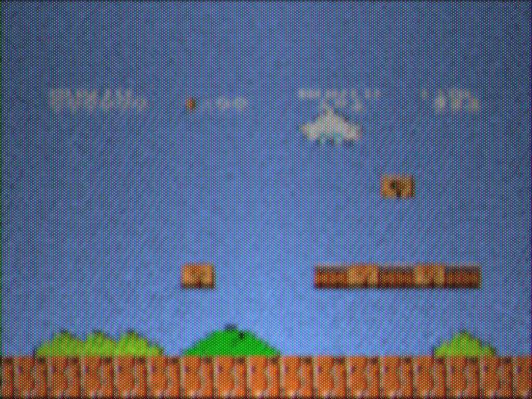

# Vector Display Simulation

a simulation of a vector display!!!

also a color crt mode!

should an a gif to show it turning on and off...

## demo animations comparison

**these need to be updated... there was a bug that caused the intensity to underflow during powerdown with the phosphor filter on**

electron beam -> phosphor -> bloom

electron beam only

electron beam -> phosphor; no bloom

electron beam -> bloom; no phosphor

